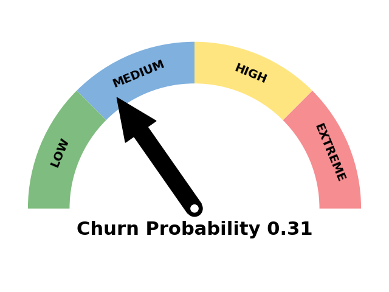

### 💫 Hi there! 👋 I'm Kipkemoi Vincent  

I am a passionate Data Scientist, ML/AI Engineer & Data Analyst with expertise in transforming raw data into actionable insights and developing scalable data science/ ML solutions in production environments. With experience across fintech, environmental science, healthcare, and agri-tech, I build machine learning models, predictive systems, 
and analytical solutions that drive growth and optimize decision-making.

Currently based in **Nairobi, Kenya**, open to opportunities **worldwide**.

---
### 🎯 My Mission  
I’m passionate about using AI and data science to tackle real-world challenges — from enhancing financial security through fraud detection to improving healthcare accessibility in underserved communities. I strive to build scalable, interpretable ML solutions that create lasting impact.

---

### 🤝 Collaboration & Communication  
Skilled at working in diverse teams, translating complex technical concepts for non-technical stakeholders, and applying agile project management to deliver impactful solutions.

---

### 🎓 Education
- MPhil in Environmental Science: The Cyprus Institute, Nicosia Cyprus.
- MSc in Mathematical Sciences(Data Science) : University of Western Cape/AIMS, Cape Town, South Africa.
- BSc. Mathematics: University of Nairobi, Nairobi, Kenya.

# 📋 Professional Summary

- 5+ years experience delivering Data Science and ML solutions across sectors (Fintech, Climate, Healthcare).
- Skilled in data analytics, predictive analytics,credit risk analysis, anomaly & fraud detection, credit scoring,
 time series forecasting, and scalable ML model deployment.
- Proficient in Python, R, SQL, Scikit-learn, CNN, OpenCV, TensorFlow, RF, LSTM,Catboost, XGBoost, LightGBM,PyOD models and AWS.
- Experienced with MLOps workflows: streamlit, Docker, Kubernetes, MLflow, FastAPI, and CI/CD pipelines.
- Committed to leveraging advanced analytics for risk minimization, business growth, and social impact.

---
## 🌍 Connect with Me  
    
📫 **Email:** vincentl@aims.ac.za/vinylango90@gmail.com

---

# 💼 Featured Projects 

## 🏥 Healthcare Accessibility in Nairobi

This project conducted a comprehensive data-driven analysis of healthcare accessibility across Nairobi's sub-counties, examining population demographics, healthcare facility distribution, and service availability in relation to SDG Goal 3 (Good Health and Wellbeing). Through spatial and statistical analysis, the study identified key disparities in access, particularly in informal settlements, and proposed actionable, evidence-based recommendations to improve healthcare infrastructure, enhance service delivery, and support equitable access to medical resources for underserved communities. 👉 Read the full project on [GitHub](https://github.com/Vinylango25/Healthcare-Accessibility-in-Nairobi)  or  [Medium](https://medium.com/@vinylango90/enhancing-healthcare-accessibility-in-nairobi-kenya-ee275471faa7)

---

  

## 🛡️ Anomaly and Fraud Detection in Finance

This project developed a scalable and interpretable fraud detection pipeline for highly imbalanced credit card transaction data. It employed advanced sampling techniques like SMOTE and SMOTEENN to balance the dataset and evaluated a range of models including Logistic Regression, Random Forest, Gradient Boosting, LightGBM, KNN, and Isolation Forest. AutoML tools such as FLAML and PyOD enhanced model tuning and anomaly detection. Feature selection methods (RFE, Mutual Information) were applied to retain key predictors, and performance was assessed using precision, recall, F1-score, ROC-AUC, and confusion matrices. To ensure transparency, LIME and SHAP were used for model explainability, enabling clear interpretation of fraud predictions. 👉 Read the full project on [Github](https://github.com/Vinylango25/Anomaly-Fraud-detection-in-Finance) or  [Medium](https://medium.com/@vinylango90/anomaly-detection-in-credit-card-transactions-using-pyod-and-microsoft-automl-flaml-727a091487bd)

---
  

## 🤖 Lending Automation - ML for Credit Scoring

This project evaluated the application of machine learning models—specifically Random Forest, XGBoost, and LightGBM—for automating credit scoring and lending decisions in order to streamline the loan approval process, reduce manual intervention, and optimize operational efficiency. The models were trained on historical loan application data to predict creditworthiness, using engineered features that captured borrower behavior, financial indicators, and risk patterns. Comparative analysis focused on performance metrics such as precision, recall, F1-score, and ROC-AUC to determine each model's predictive power and reliability. In addition to model accuracy, emphasis was placed on computational efficiency and scalability to ensure the solution could be deployed in real-time lending environments. The outcome demonstrated that ML-driven credit scoring can significantly shorten processing time, reduce default risk, and enable data-driven lending strategies that improve customer experience and operational throughput.  👉 Read the full project on [Github](https://github.com/Vinylango25/Credit-Scoring-Lending-automation) or [Medium](https://medium.com/@vinylango90/credit-scoring-lending-automation-6dabe30d53da)

---
  

## 🌍 Air Quality Monitoring in Nicosia, Cyprus

This project focused on developing and evaluating machine learning models—namely Random Forest, Artificial Neural Networks (ANN), and XGBoost—to calibrate low-cost gas sensors measuring pollutants such as CO, NO₂, O₃, and SO₂ for urban air quality monitoring. The primary objective was to improve sensor accuracy and achieve data quality standards compliant with EU directives. To address challenges posed by sensor cross-sensitivity and environmental variability, the models incorporated techniques for correcting sensor interference and adjusting for ambient conditions such as temperature and humidity. Feature engineering and data preprocessing played a key role in enhancing model robustness. The calibrated models successfully improved the reliability of gas concentration readings, particularly for CO, NO₂, and O₃. In addition to model development, the project proposed a scalable and cost-effective sensor network deployment strategy to support continuous, real-time air quality monitoring in urban environments, making the solution both scientifically rigorous and practically deployable.  👉 Read the full project on [Github](https://github.com/Vinylango25/Air-Quality-in-Nicosia-Cyprus)  or [Medium](https://medium.com/@vinylango90/sensor-calibration-and-air-quality-monitoring-in-nicosia-cyprus-e5072a4184aa)

---
  

## 📉 Customer Churn Analysis and Prediction

Developed a system to analyze customer churn using survival analysis techniques. Implemented Kaplan-Meier curves and Cox Proportional Hazards models to understand churn over time and estimate customer lifetime value. Built a Random Forest classifier to predict churn, achieving an F1 score of 0.62 and ROC-AUC of 0.85. Deployed a Flask web app featuring SHAP visualizations, survival/hazard curves, and churn probability gauges for individual customer insights. 👉  Read the full project on [Github](https://github.com/Vinylango25/Customer_Churn_Analysis_And_Prediction)

---
  

## 💼 Full Projects Summary

| Project | Description | Tools Used |
|--------|-------------|------------|
| [🛡️ Anomaly and Fraud Detection in Finance](https://github.com/Vinylango25/Anomaly-Fraud-detection-in-Finance) | Conducted a comprehensive anomaly detection project on an imbalanced credit card fraud dataset. Compared traditional and AutoML models (PyOD, FLAML), applied feature selection techniques, and evaluated performance under SMOTE and SMOTEENN balancing. Used multiple detectors including Logistic Regression, Random Forest, Gradient Boosting, LightGBM, KNN, and Isolation Forest. Performed global and local explainability analysis with LIME and SHAP to assess model interpretability and decision transparency. | Python, Scikit-learn, LightGBM, FLAML, PyOD, LIME, SHAP |
| [🏥 Healthcare Accessibility in Nairobi](https://github.com/Vinylango25/Healthcare-Accessibility-in-Nairobi) | Conducted an extensive data-driven analysis of healthcare accessibility across Nairobi's sub-counties. Assessed population demographics, facility distributions, service availability, and alignment with SDG Goal 3 (Health and Wellbeing). Proposed actionable recommendations for improving healthcare infrastructure and service coverage, especially in underserved slum areas. | Python, Pandas, Matplotlib, Seaborn, Jupyter Notebook |
| [🤖 Lending Automation - ML for Credit Scoring](https://github.com/Vinylango25/Credit-Scoring-Lending-automation) | Evaluated how Random Forest, XGBoost, and LGBM can automate lending decisions, reduce loan processing time and operational costs, and scale lending operations efficiently. | Python, Scikit-learn, RF, XGBoost, LightGBM |
| [🌍 Air Quality Monitoring in Nicosia, Cyprus](https://github.com/Vinylango25/Air-Quality-in-Nicosia-Cyprus) | Developed machine learning models (Random Forest, ANN, XGBoost) to calibrate low-cost gas sensors (CO, NO₂, O₃, SO₂) for urban air quality monitoring. Achieved EU directive-compliant data quality for CO, NO₂, and O₃ measurements through sensor cross-sensitivity correction, environmental factor adjustment, and optimized calibration strategies. Proposed cost-effective network deployment methodologies. | Python, Scikit-learn, XGBoost, Random Forest, Data Analysis, Jupyter Notebook |
| [📉 Customer Churn Analysis and Prediction](https://github.com/Vinylango25/Customer_Churn_Analysis_And_Prediction) |Developed a system to analyze customer churn using survival analysis techniques. Implemented Kaplan-Meier curves and Cox Proportional Hazards models to understand churn over time and estimate customer lifetime value. Built a Random Forest classifier to predict churn, achieving an F1 score of 0.62 and ROC-AUC of 0.85. Deployed a Flask web app featuring SHAP visualizations, survival/hazard curves, and churn probability gauges for individual customer insights. | Python, Flask, Scikit-learn, SHAP, Cox Proportional Hazards Model, Survival Analysis |
| [📊 Sales Time Series Analysis](https://github.com/Vinylango25/Sales_Time_Series_Analysis) | Analyzed sales data to identify trends and forecast future sales using time series models. | Python, Pandas, Matplotlib |
| [💻 Machine Learning Loan Application Web App](https://github.com/Vinylango25/Machine_Learning_Loan_Application_Web_App) | Built a web app to predict loan approvals using ML algorithms. | Python, Flask, Scikit-learn |
| [🚀 Active Learning API (Django + CatBoost)](https://github.com/Vinylango25/active-learning-backend) | Django REST API for querying, labeling, and training an Active Learning model using CatBoost. | Django, CatBoost, REST API, SQLite |
| [🔍 Production Ready Anomaly Detection System](https://github.com/Vinylango25/Production_ready_anomaly_detection_streamlit) | Created a scalable anomaly detection system for real-time use. | PyOD, MLflow, Docker |
| [🩺 COVID-19 Detection Using CT Scans](https://github.com/Vinylango25/Covid-19-Detection-Deep-Learning) | Used CNN models (CustomCNN, MobileNetV2, DenseNet169, ResNet50) on real hospital CT scan data from Brazil to detect COVID-19, achieving up to 99% accuracy with model ensembling. | Python, TensorFlow, Keras, CNNs |
| [🧠 Brain Tumor Detection Using Deep Learning](https://github.com/Vinylango25/Brain-Tumor-Detection-Using-Deep-Learning) | Developed CNN models (CustomCNN, MobileNetV2, DenseNet169, ResNet50) to detect brain tumors from MRI scans, achieving 92–99.8% accuracy with ensemble learning and AutoML optimization. | Python, TensorFlow, Keras, FLAML |

---

## 💻 Tech Stack  

  
  
  
  
  
  
  
  
  
  
  
  
  
  
  
  
  
  
  
  
  
  
  
  
  
  
  
  
  
  
  
  
  
  

## 🏆 GitHub Trophies

  

---

## 📊 GitHub Stats

<table>
<tr>
<td align="center">
  
### **Vinylango25 Stats**  
 
  
  

</td>

<td align="center">

### **Vinylango Stats**  

  
  

</td>
</tr>
</table>

## 📜 Random Dev Quote  
  

---

## 🚀 Let's Collaborate!  
I am open to working on **AI, ML, data science, and fintech projects**.  
💬 **Reach out to me for exciting collaborations!**  
